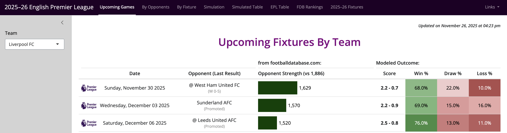

# [English Premier League Dashboard](https://ans8493.shinyapps.io/English_Premier_League/)

---

This is a shiny dashboard to track the results of teams in the English Premier League. 

There is a separate scripts for each dashboard tab and the names match the UI and Server sections for ease of editing.

Dashboard Tabs:

1. Upcoming Games
2. Results by Fixture
3. Results by Opponent
4. Simulation of Current Season
5. Simulated Table
6. EPL Table
7. [FDB Rankings](https://www.footballdatabase.com/clubs-list-country/england)
8. Complete list of fixtures for EPL teams

**To run app:**
Open **`EPL_Shiny.R`** and click **`Run App`**

**Note:** The input files are beyond the scope of this repository. They are processed in a separate workflow but are included as an example.

---